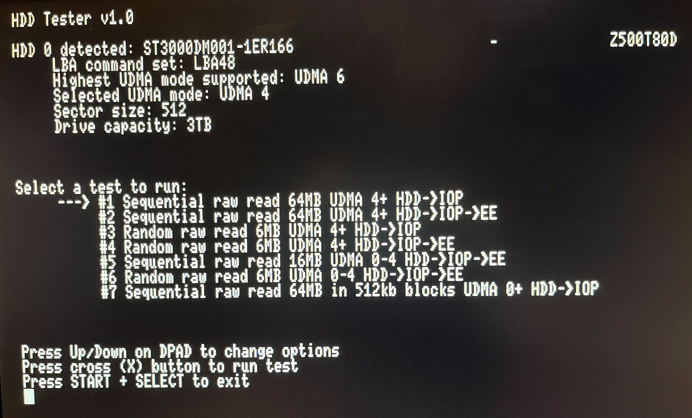
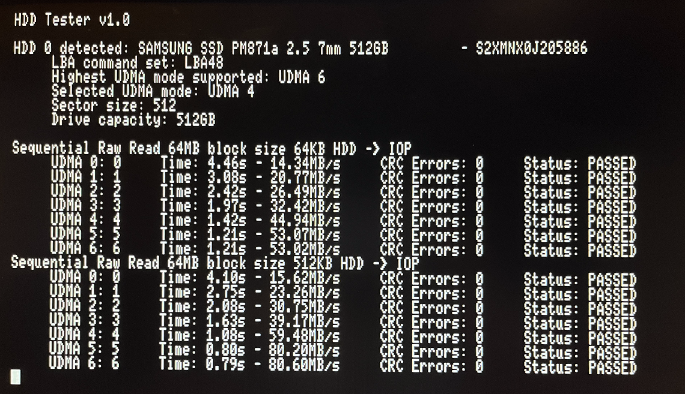

# PS2HDDTester
HDD speed test tool for PlayStation 2 consoles. Using this tool you can run various speed tests on an internal HDD as well as view some basic HDD info such as sector size and supported UDMA modes.



Note: All data and screenshots in this post were performed using an official Sony network adapter with the BitFunx sata board.

## Compiling
You'll need the latest version of [ps2sdk](https://github.com/ps2dev/ps2sdk) installed to compile HDDTester. After cloning the repository you can cd into the hddtester folder and run make.
```
git clone https://github.com/GrimBrew/PS2HDDTester.git
cd ./hddtester/hddtester
make
```

### Borrowed code
HDDTester uses the atad iop module from ps2sdk with some slight modifications to get additional error info, as well as the xhdd iop module from [OPL](https://github.com/ps2homebrew/Open-PS2-Loader) to help facilitate the speed tests and send additional commands to the drive.

## Explanation of speed tests
There are a number of different speed tests for performing benchmarks on sequential reads, random reads, and maximum throughput. The tests come in two varieties: HDD -> IOP, and HDD -> EE. Because the HDD controller is connected to the IOP all data must pass through the IOP before it can be transferred to the EE, where it can be processed by the running application. This requires two DMA operations, one from the HDD controller to the IOP, and one from the IOP to the EE. I've added two varieties for most tests so you can see what the actual read speed is off the HDD (HDD -> IOP), and what the full trip time is from the HDD to the running application (HDD -> EE).

The reads times for the HDD -> IOP tests can be considered your theoretical times, and the HDD -> EE times can be considered your actual times. Test #7 is basically your "high score" test, it serves no real purpose other than prove that UDMA 5 (and 6) are functional on the PS2, and it can actually operate at UDMA 5 speeds.

Below is a breakdown of what each test does:
1. Sequential read of 64MB in various block sizes from the HDD -> IOP at UDMA 4 to the highest UDMA mode supported by the drive.
2. Same as #1 but reads from the HDD -> EE.
3. Reads 6MB of data in various block sizes from the HDD -> IOP at UDMA4 to the highest UDA mode supported by the drive. After each read it will seek forward or backwards by a random number of sectors up to 1 gigabyte.
4. Same as #3 but reads from the HDD -> EE.
5. Sequential read of 16MB in various block sizes from the HDD -> EE at UDMA 0-4.
6. Reads 6MB of data in various block sizes from the HDD -> EE at UDMA 0-4. After each read it will seek forward or backwards by a random number of sectors up to 1 gigabyte.
7. Sequential read of 64MB in 512Kb blocks from the HDD -> IOP at UDMA 0 to the highest UDMA mode supported by the drive.

### Block sizes and UDMA modes
By varying the UDMA mode and block sizes for reads we can see how each affects the speed of reading data from the HDD. Lower block sizes = slower read times regardless of the UDMA mode selected. Using larger block sizes and higher UDMA modes work together for better results. Reading data in blocks of 2Kb at UDMA 4/5/6 has negligible performance gains compared to UDMA 0, whereas reading data in blocks of 16Kb at UDMA 4 will be ~50% faster than at UDMA 0. The trade off here is IOP memory used to perform the reads. Because all data must be read into IOP memory before it can be sent to the EE, larger block sizes = more IOP memory needed.

## UDMA 5/6
Running test #7 I've been able to achieve up to 80MB/s between the HDD and IOP, which proves that UDMA 5 and 6 do work and will operate at higher than UDMA 4 maximum speed. However, these speeds are only achievable by using massive block sizes of 512Kb+ for the transfers. To put this into perspective, 512Kb is 1/4th of the available RAM the IOP has, and is not something any game (or homebrew application) would ever use for data transfers. This test was purely to show that the speeds are possible, and that UDMA 5 and 6 do work.



While HDD IO will function just fine if the drive is put into UDMA 6 (and presumably UDMA 7 as well), I don't know that it's possible to get higher than UDMA 5 throughput to the IOP. By tweaking various things I was able to get a bit more throughput out of this transfer, and I suspect if the drivers on the IOP stack where optimized specifically for transfer speed you could get the throughput even higher, but I don't know if it would surpass the 100MB theorehtical maximum of UDMA 5 (though I would love to see someone try!).

So how does this effect loading times for games running off the HDD? For any games using large transfer sizes (32Kb or higher) there will be slight performance gains IF the data being read is contiguous (the sectors being read are sequential, not fragmented or split up). I don't know if there would be any noticeable difference in-game, but I suspect the answer is no. This would mostly affect streaming IO for things like music, videos, etc., which typically require a continuous flow of data that's read asynchronously. However, if the sectors being read are not contiguous (ie: they are fragmented) then the performance gains from running at UDMA 5 or 6 is negligible at best.

## Mechanical vs SSD and drive speed
So does a SSD perform better than a mechanical HDD when put inside of a PS2? Yes, but not in all cases. Comparing the results from the sequential read tests on a SDD vs a 7200 rpm mechanical HDD the results are almost identical, in fact, the mechanical HDD actually out performed the SSD more often than the SSD out performed the HDD (though the difference in time is negligible at best). However, in the random read tests the SSD was 10x faster for block sizes of 2Kb and 4Kb, and 5x faster in block sizes of 16Kb and 32Kb. So for non-sequential reads the SSD will wipe the floor with the HDD. I guess that's good if your drive is fragmented to hell but I don't know how much of those gains will actually be realized when loading a game off the HDD.

So what about drive speed for mechanical drives, how much slower is a 5400 rpm drive vs. a 7200 rpm drive? For sequential read tests the 7200 rpm drive will complete read operations ~2-3 seconds faster on average than the 5400 rpm drive. For random read tests the 7200 rpm drive will complete ~10 seconds faster for block sizes of 2Kb and 4Kb, and 1-2 seconds faster for larger block sizes.

## Speed test results
Here is a table of the results for the speed tests I ran on a SSD, 7200 rpm HDD, and 5400 rpm HDD.

### Sequential read 64MB HDD -> EE
| UDMA | Block Size (Kb) | SSD | 7200 HDD | 5400 HDD |
|---|---|---|---|---|
| 4 | 2Kb | 21.13s - 3.03MB/s | 21.12s - 3.03MB/s | 24.02s - 2.66MB/s |
| 5 | 2Kb | 21.12s - 3.03MB/s | 20.75s - 3.08MB/s | 23.16s - 2.76MB/s |
| 6 | 2Kb | 21.11s - 3.03MB/s | 20.17s - 3.17MB/s | N/A |
| 4 | 4Kb | 11.25s - 5.69MB/s | 11.26s - 5.68MB/s | 12.80s - 5.00MB/s |
| 5 | 4Kb | 11.25s - 5.69MB/s | 11.07s - 5.78MB/s | 12.80s - 5.00MB/s |
| 6 | 4Kb | 11.25s - 5.69MB/s | 10.67s - 6.00MB/s | N/A |
| 4 | 16Kb | 3.97s - 16.12MB/s | 3.95s - 16.22MB/s | 5.70s - 11.22MB/s |
| 5 | 16Kb | 3.93s - 16.29MB/s | 3.92s - 16.33MB/s | 5.82s - 11.00MB/s |
| 6 | 16Kb | 3.89s - 16.46MB/s | 3.81s - 16.82MB/s | N/A |
| 4 | 32Kb | 2.82s - 22.66MB/s | 2.85s - 22.50MB/s | 4.66s - 13.74MB/s |
| 5 | 32Kb | 2.69s - 23.82MB/s | 2.69s - 23.82MB/s | 4.50s - 14.22MB/s |
| 6 | 32Kb | 2.69s - 23.82MB/s | 2.65s - 24.14MB/s | N/A |

### Random read 6MB HDD -> EE
| UDMA | Block Size (Kb) | SSD | 7200 HDD | 5400 HDD |
|---|---|---|---|---|
| 4 | 2Kb | 2.76s - 2.17MB/s | 21.44s - 0.28MB/s | 36.40s - 0.16MB/s |
| 5 | 2Kb | 2.77s - 2.17MB/s | 21.35s - 0.28MB/s | 35.55s - 0.17MB/s |
| 6 | 2Kb | 2.75s - 2.18MB/s | 21.30s - 0.28MB/s | N/A |
| 4 | 4Kb | 1.46s - 4.12MB/s | 10.73s - 0.56MB/s | 17.99s - 0.33MB/s |
| 5 | 4Kb | 1.45s - 4.13MB/s | 10.87s - 0.55MB/s | 17.77s - 0.34MB/s |
| 6 | 4Kb | 1.45s - 4.13MB/s | 10.97s - 0.55MB/s | N/A |
| 4 | 16Kb | 0.48s - 12.53MB/s | 2.79s - 2.15MB/s | 4.63s - 1.30MB/s |
| 5 | 16Kb | 0.47s - 12.79MB/s | 2.77s - 2.16MB/s | 4.65s - 1.29MB/s |
| 6 | 16Kb | 0.47s - 12.82MB/s | 2.82s - 2.13MB/s | N/A |
| 4 | 32Kb | 0.32s - 18.81MB/s | 1.48s - 4.05MB/s | 2.41s - 2.49MB/s |
| 5 | 32Kb | 0.30s - 19.80MB/s | 1.42s - 4.22MB/s | 2.50s - 2.40MB/s |
| 6 | 32Kb | 0.30s - 19.87MB/s | 1.46s - 4.11MB/s | N/A |

### Sequential read 64MB block size 512Kb HDD -> IOP
| UDMA | SSD | 7200 HDD | 5400 HDD |
|---|---|---|---|
| 0 | 4.11s - 15.56MB/s | 4.52s - 14.15MB/s | 6.44s - 9.94MB/s |
| 1 | 2.80s - 22.90MB/s | 2.80s - 22.83MB/s | 4.62s - 13.86MB/s |
| 2 | 2.13s - 29.98MB/s | 2.14s - 29.85MB/s | 4.09s - 15.64MB/s |
| 3 | 1.69s - 37.80MB/s | 1.70s - 37.65MB/s | 3.69s - 17.33MB/s |
| 4 | 1.13s - 56.69MB/s | 1.14s - 56.19MB/s | 3.16s - 20.26MB/s |
| 5 | 0.84s - 76.10MB/s | 0.85s - 75.47MB/s | 3.11s - 20.55MB/s |
| 6 | 0.83s - 76.65MB/s | 0.84s - 75.83MB/s | N/A |
